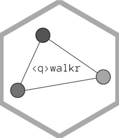

<!-- README.md is generated from README.Rmd. Please edit that file -->

```{r, include = FALSE}
knitr::opts_chunk$set(
  collapse = TRUE,
  comment = "#>",
  fig.path = "man/figures/README-",
  out.width = "100%"
)
```

# qwalkr <a href="https://vitormarquesr.github.io/qwalkr/"></a>

<!-- badges: start -->
[](https://github.com/vitormarquesr/qwalkr/actions/workflows/R-CMD-check.yaml)
<!-- badges: end -->

## Overview 

qwalkr is a numerical suite for investigating quantum walks, providing estimates of matrices of interests that help you obtain insight into the evolution of such systems:

**Quantum Walks**

* `ctqwalk()` creates a continuous-time quantum walk.

**Investigate the Hamiltonian**

* `get_eigspace()` obtains the eigenvectors associated with an eigenspace.
* `get_eigproj()` obtains the orthogonal projector associated with an eigenspace.
* `get_eigschur()`obtains the Schur product of orthogonal projectors.
* `act_eigfun()` applies a function to the Hamiltonian.

**Time Evolution**

* `unitary_matrix()` returns the unitary time evolution operator at a given time.
* `mixing_matrix()` returns the mixing matrix at a given time.

**Average Evolution**

* `avg_matrix()` returns the average mixing matrix.
* `gavg_matrix()` returns the generalized average mixing matrix under a probability distribution.

## Installation

Currently, qwalkr is only available on GitHub. You can install the development version of it like so:

```{r, eval=FALSE}
# install.packages("devtools")
devtools::install_github("vitormarquesr/qwalkr")
```

## Usage

```{r}
library(qwalkr)

K3 <- rbind(c(0, 1, 1),
            c(1, 0, 1),
            c(1, 1, 0))

w <- ctqwalk(hamiltonian = K3)

w


get_eigproj(w, id=2)

unitary_matrix(w, t=pi/3)

mixing_matrix(w, t=pi/3)

avg_matrix(w)

```
## Getting Help

For further reference on the usability, check the vignette or the website of the package.

If you happen to encounter a bug, please file an issue on GitHub.


